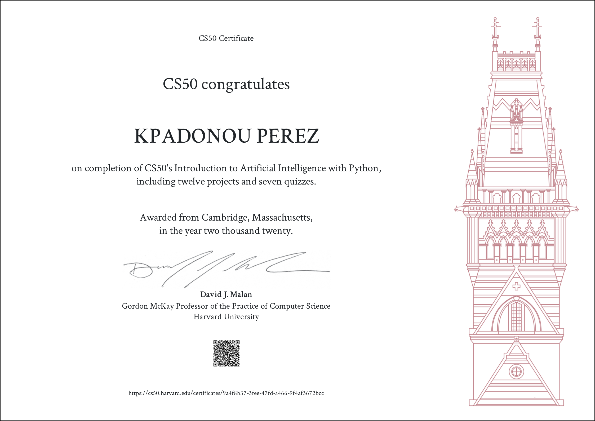

# Projects_CS50_Artificial_Intelligence
Projects in **Python** \
**CS50AI 2020 PSets solutions - (HarvardX, Completed in Fall 2020)**

## Overview
This repository contains my [HarvardX's CS50AI 2020](https://cs50.harvard.edu/ai/2020/) programming projects. 

## Contents
<!--
- `pset6`: [Mario Pyramid generator (in Python)](/%20Mario%20Pyramid%20generator%20(in%20Python)%20–%206.2./); [Cash Coin change (in Python)](/%20%20Cash%20Coin%20change%20(in%20Python)%20–%20%206.3./); [Readability Level estimator (in Python)](/%20%20%20Readability%20Level%20estimator%20(in%20Python)%20–%20%206.4./); [DNA Profiling (in Python)](/%20%20%20%20DNA%20Profiling%20(in%20Python)%20–%206.5./)
- `pset7`: [Movie Database querying (in SQL)](/%20%20%20%20%20Movie%20Database%20querying%20(in%20SQL)%20–%207.1./); [Hogwarts House queries (in Py and SQL)](/%20%20%20%20%20%20Hogwarts%20House%20queries%20(in%20Py%20and%20SQL)%20–%207.2./)
- `pset8`: Homepage Basic website (in HTML, CSS, and JavaScript)
Website with Flask and JavaScript (Web)
- `final_project`: [Project Name/Description]
-->

## Topics covered
📚 Topics Covered include:

0. Search \
[Lecture notes](https://cs50.harvard.edu/ai/2020/notes/0/), [Files](https://cs50.harvard.edu/ai/2020/weeks/0/) \
Finding a solution to a problem, like a navigator app that finds the best route from your origin to the destination, or like playing a game and figuring out the next move. \
Uninformed search (Depth-First Search, Breadth-First Search) -  Informed search (Greedy Best-First Search [use heuristic function], A* Search [use heuristic and cost estimation]) - Adversarial search (Minimax, Alpha-Beta Pruning, Depth-Limited Minimax)

2. Knowledge \
Representing information and drawing inferences from it.

3. Uncertainty \
Dealing with uncertain events using probability.

4. Optimization \
Finding not only a correct way to solve a problem, but a better—or the best—way to solve it.

5. Learning \
Improving performance based on access to data and experience. For example, your email is able to distinguish spam from non-spam mail based on past experience.

6. Neural Networks \
A program structure inspired by the human brain that is able to perform tasks effectively.

7. Language \
Processing natural language, which is produced and understood by humans.

## Certificate

